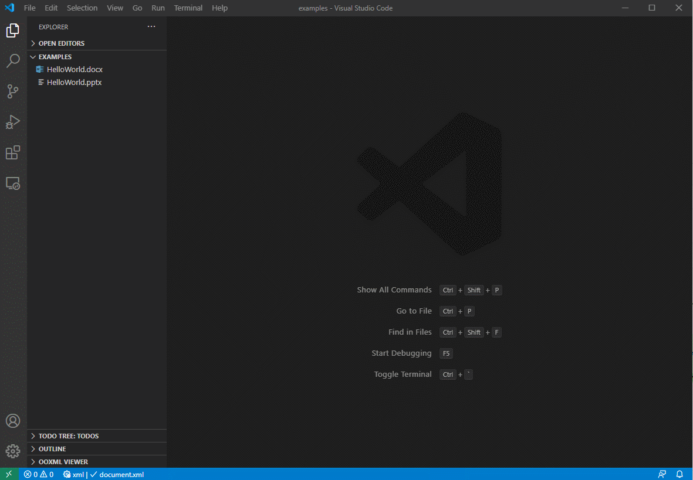
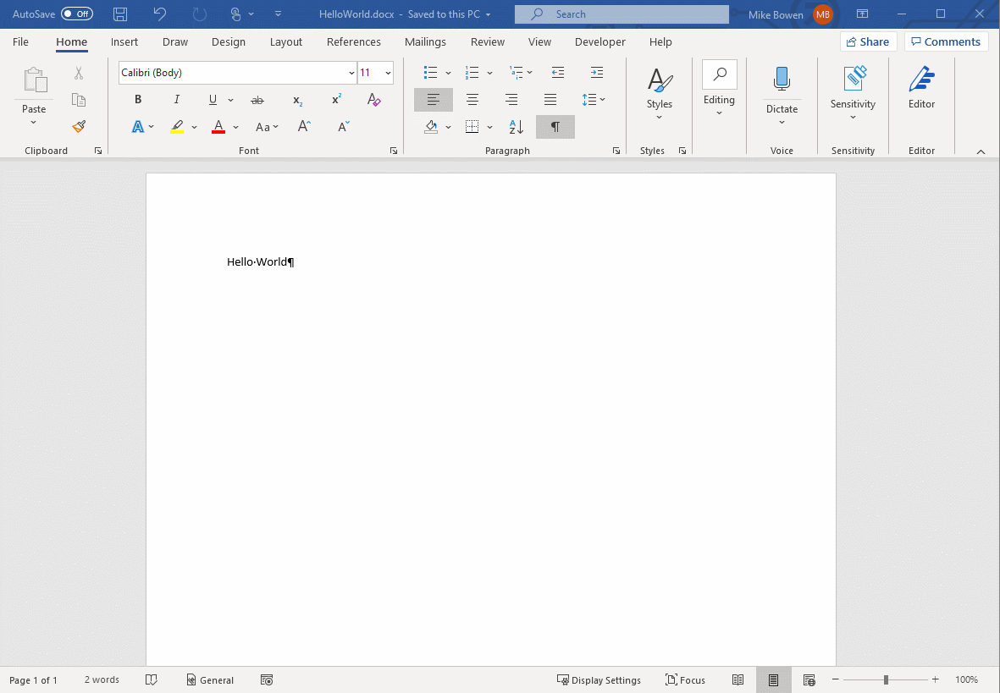
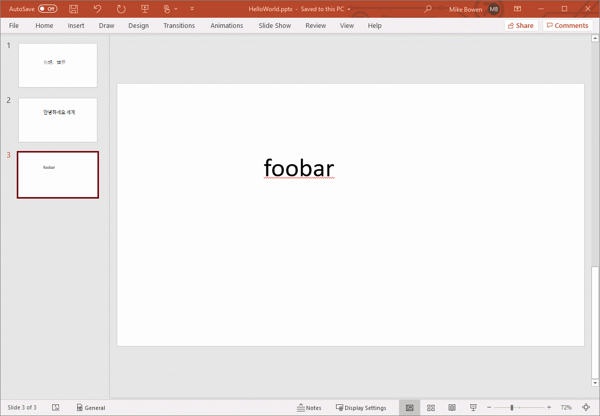

# OOXML Viewer VSCode Extension

## Features

- [Displays the contents of OOXML documents in VS Code](#displays-the-contents-of-ooxml-documents-in-vs-code)
- [Edit the contents of an OOXML documents in VS Code](#edit-the-contents-of-an-ooxml-documents-in-vs-code)
- [Get diff when OOXML documents are edited from outside, e.g. in Microsoft Word, Libre Office Writer, Microsoft Excel, Libre Office Calc, etc.](#user-content-get-diff-when-ooxml-documents-are-edited-from-outside-eg-in-microsoft-word-libre-office-writer-microsoft-excel-libre-office-calc-etc)

### Displays the contents of OOXML documents in VS Code

To view the contents of an OOXML document, right click on the file in the context menu, then click on the part you want to view.

### Edit the contents of an OOXML documents in VS Code

To edit an OOXML part, select the part in the OOXML Viewer menu then edit and save. The changes will be reflected in the OOXML document.

### Get diff when OOXML documents are edited from outside, e.g. in Microsoft Word, Libre Office Writer, Microsoft Excel, Libre Office Calc, etc.

When a document opened by the OOXML Viewer is edited from an outside program, changed parts are marked with a yellow asterisk, deleted parts are marked with a red asterisk, and new parts are marked with a green asterisk.

To view a diff with the previous version of an OOXML part, right click on the part in the OOXML Viewer menu and click "Compare with Previous".

---

---

Please see the [Change Log](CHANGELOG.md)
